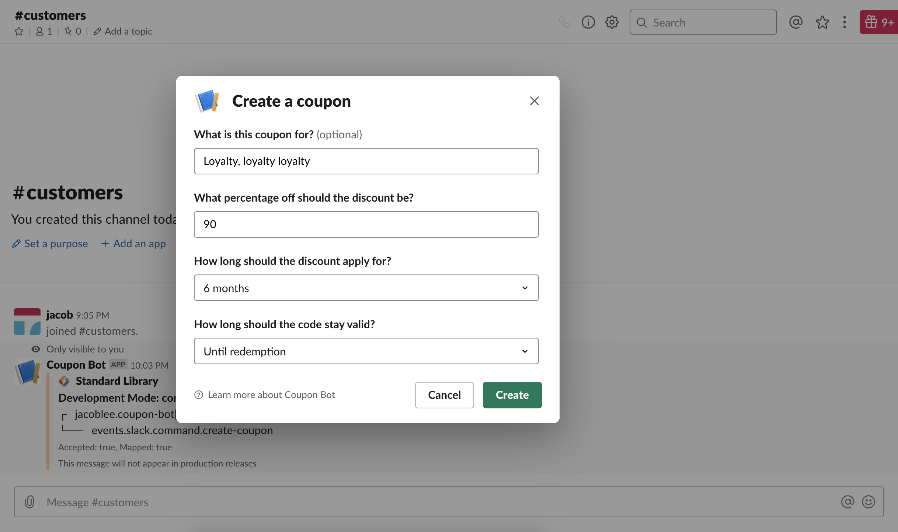
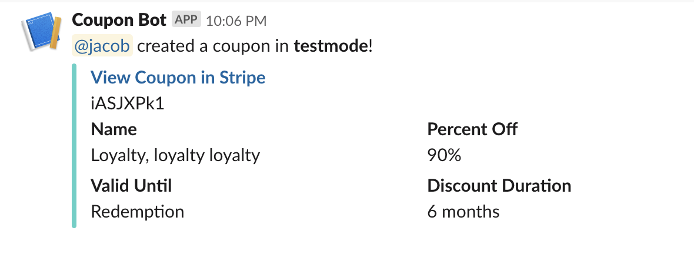
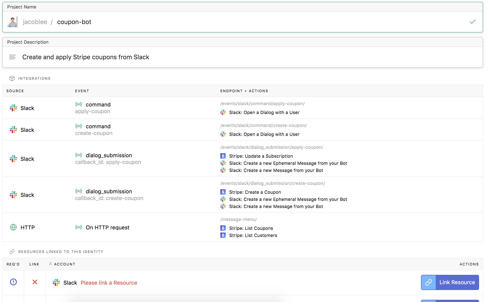

# Stripe Coupon Management Slack App

This is a Slack and Stripe based coupon management system, written in Node.js
on [Standard Library](https://stdlib.com). After generating a coupon code with the `/create-coupon` slash command, you can either give the code to a potential new subscriber or apply the code directly to an existing subscription with the `/apply-coupon` command.

## Deploying this Application

You can deploy this Slack App to [Standard Library](https://stdlib.com) by clicking this button:

You'll be asked to create a new account or log in, then you will see a screen summarizing your app:

As the table shows, your app has five handlers:
1. `events/slack/command/apply-coupon.js`, the slash command that opens a dialog that applies coupons to existing subscribers.
1. `events/slack/command/create-coupon.js`, the slash command that opens a dialog that creates new coupons.
1. `events/slack/dialog_submission/apply-coupon.js`, the handler that gets called when you submit the coupon application dialog. It calls the Stripe API to update the appropriate subscription.
1. `events/slack/dialog_submission/create-coupon.js`, the handler that gets called when you submit the coupon creation dialog. It calls the Stripe API to create a coupon with the parameters from the dialog.
1. `message-menu.js`, the endpoint that retrieves coupon and subscription data from Stripe and populates the menus in the dialog. It acts as a data source for the menus within the dialog.

The final step before deploying the app is linking a Slack app and a Stripe app in **test mode**.

### Stripe

Click the **Link Resource** button, then select a Stripe app. You're linking your Stripe app in test mode, so your coupon management bot will not interact with any live data yet –– you'll be able to link your production Stripe app after you've tested everything!

### Slack

Click **Link Resource** and follow the instructions to build and link a Slack app.

After you choose your app, you will still need to register the `/create-coupon` and `/apply-coupon` commands separately in your Slack app dashboard.

### Creating the Commands on Slack

You can create the `/create-coupon` and `/apply-coupon` commands by visiting [api.slack.com/apps](https://api.slack.com/apps),
selecting your app, then clicking **Slash Commands** on the left sidebar.

Click **Create Command** and fill out the first command information. You'll want to
use `/create-coupon` as the command name and `https://<username>.events.stdlib.com/` as the
URL, where `<username>` is your Standard Library username.

Click **Save** in the bottom right to proceed. Repeat this process for `/apply-coupon`.

### Set your Options Load URL

Finally, click **Interactive Components** on the left sidebar. Enable interactivity if it is not enabled and make sure that the **Interactivity** URL is set as `https://<username>.events.stdlib.com`, then scroll down to "Message Menus" and set the "Options Load URL" to be:
`https://<username>.api.stdlib.com/coupon-bot@dev/message-menu/`

Where `<username>` is your Standard Library username.

That's it, you're all done! Your Slack app should be ready to go.

# Thank You!

Please check out [Standard Library](https://stdlib.com/) or follow us on Twitter,
[@StdLibHQ](https://twitter.com/@StdLibHQ).